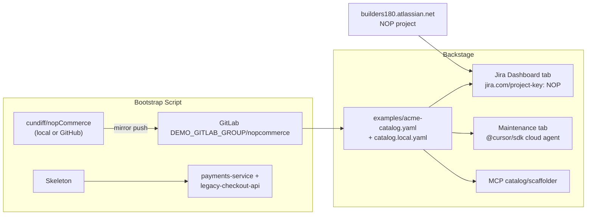

# Seed Full Demo Data (Backstage + Cursor + Jira + nopCommerce)

**Plan ID:** `enterprise-demo-seed`  
**Status:** Implemented — merged to `main` (see `docs/demo-setup.md` for runbook)  
**Repo:** `/Users/iancundiff/demos/platform/backstage`  
**Backstage version:** 1.51.0 (`backstage.json`)

## Problem

The current demo is a thin catalog (2 components, 1 system, owner `guests`) with hardcoded `acme/` GitLab slugs and a synthetic `payments-service` hero. Flow 2 maintenance backend is wired, but the **frontend plugin is not registered in `packages/app`**, so the Maintenance tab likely does not render. There is no bootstrap script, no Jira visibility, and no anchor on the real `cundiff/nopCommerce` fork that already has Cursor skills (`.cursor/skills/start-local-nopcommerce`) but no root `AGENTS.md`.

We need a richer, enterprise-shaped catalog (~15 entities across 4 systems and 4 teams), GitLab repos created idempotently from local sources, Jira NOP board on the hero entity, and updated runbooks/scripts so all three demo flows work end-to-end before a screen share.

## Scope

**In scope**

- Configurable GitLab group via `DEMO_GITLAB_GROUP` + generated `examples/catalog.local.yaml`
- Rich committed catalog (`examples/acme-catalog.yaml`, expanded `examples/org.yaml`)
- Bootstrap script: mirror nopCommerce, scaffold golden-path + legacy repos, emit local catalog
- Axis Jira Dashboard plugin (backend + frontend) for project **NOP** on `builders180.atlassian.net`
- Wire `@internal/plugin-cursor-maintenance` into `packages/app`
- Template rebrand (legacy vs golden path), maintenance backlog enrichment, minimal TechDocs
- `.env.example`, `scripts/preflight-demo.sh`, updates to `docs/demo-setup.md` and `README.md`
- Maintenance backend test URL cleanup

**Out of scope**

- Rally integration (document as customer context only)
- Self-hosted Cursor workers
- Literal 50–100 catalog entities (target is **enterprise feel** via org, systems, dependency mesh, and links)
- Full nopCommerce monorepo refactors in live Flow 2 demos

## Acceptance criteria

- [ ] Catalog loads 10+ entities across 3+ systems with team owners (not `guests`)
- [ ] `./scripts/bootstrap-gitlab-demo.sh` creates `nopcommerce`, `payments-service`, and `legacy-checkout-api` under `DEMO_GITLAB_GROUP`
- [ ] `examples/catalog.local.yaml` resolves all `gitlab.com/project-slug` annotations to bootstrapped repos
- [ ] `nopcommerce-platform` shows **Jira**, **Maintenance**, and **TechDocs** tabs in the catalog UI
- [ ] Flow 1 contrast works: legacy template has no `AGENTS.md`; golden path scaffolds with `AGENTS.md`
- [ ] Flow 2 streams SSE events from `nopcommerce-platform` (or `payments-service` fallback) and produces an MR link
- [ ] Flow 3 MCP answers "Who owns nopcommerce-platform?" and surfaces NOP Jira project context
- [ ] `yarn workspace @internal/plugin-cursor-maintenance-backend test` passes
- [ ] `docs/demo-setup.md` + `.env.example` + preflight script cover all required env vars

## Risks

| Risk | Mitigation |
|------|------------|
| nopCommerce repo size → slow cloud agents | Narrow maintenance tasks; pre-run before demo; document in setup |
| No root `AGENTS.md` on fork today | Bootstrap injects before GitLab push |
| `tax-service` is catalog-only (no `services/tax-service` dir on `develop`) | Annotate as sub-path concept or link to branch `cursor/tax-service-node-migration-203e` in TechDocs |
| Jira Cloud auth | Email + API token; document in `.env.example` |
| `catalog.local.yaml` missing before first boot | Runbook: bootstrap before `yarn start`; preflight warns if absent |
| Axis Jira plugin vs Backstage 1.51 | Pin compatible `@axis-backstage/plugin-jira-dashboard*` versions; smoke-test tab |
| Maintenance UI broken today | Explicit Phase 1 task: add frontend plugin to `packages/app` |

## Architecture



**Customer context:** The target customer uses Rally for planning. This demo intentionally uses **Jira (NOP)** for on-screen visibility. No Rally plugin work.

---

## Implementation todos

Track these in order; later phases depend on earlier ones.

### Phase 1 — Fix broken UI + catalog foundation

- [ ] Add `@internal/plugin-cursor-maintenance` to `packages/app/package.json` and import in `packages/app/src/App.tsx` (today only `catalogPlugin` + `navModule` are registered)
- [ ] Add `examples/demo-config.yaml`, `examples/acme-catalog.yaml`; expand `examples/org.yaml`
- [ ] Register `catalog.local.yaml` in `app-config.yaml` after `entities.yaml`; keep `entities.yaml` minimal or migrate entries into `acme-catalog.yaml`

### Phase 2 — Jira

- [ ] Install `@axis-backstage/plugin-jira-dashboard` + `@axis-backstage/plugin-jira-dashboard-backend`
- [ ] Add backend import in `packages/backend/src/index.ts`; configure `jiraDashboard` in `app-config.yaml`
- [ ] Add frontend plugin + `entity-content:jira-dashboard/entity` extension in `app-config.yaml`

### Phase 3 — Bootstrap + skeletons

- [ ] Create `scripts/bootstrap-gitlab-demo.sh` (idempotent)
- [ ] Create `scripts/skeletons/legacy-checkout-api/` (no `AGENTS.md`)
- [ ] Bootstrap mirrors nopCommerce from `NOPCOMMERCE_SOURCE` (default `/Users/iancundiff/demos/stacks/dotnet/nopCommerce`), injects root `AGENTS.md`, pushes to GitLab
- [ ] Bootstrap scaffolds `payments-service` from golden-path skeleton and emits `examples/catalog.local.yaml`

### Phase 4 — Polish

- [ ] Rebrand `examples/template/template.yaml` → **Legacy Service (No Golden Path)**; add contrast README
- [ ] Golden-path template: default owner `group:default/platform-team`, TechDocs tag
- [ ] Maintenance backlog cards + GitLab link UX in `plugins/cursor-maintenance`
- [ ] Add `examples/docs/nopcommerce-platform/` + TechDocs ref on hero entity

### Phase 5 — Docs + verification

- [ ] Update `docs/demo-setup.md`, `README.md`
- [ ] Add `.env.example` and `scripts/preflight-demo.sh`
- [ ] Update `acme/` URLs in maintenance backend tests; run test suite

---

## Current state (verified gaps)

| Area | Today | Gap |
|------|-------|-----|
| Catalog | 2 components, 1 `examples` system, owner `guests` (`examples/entities.yaml`) | Needs org teams, 4 systems, 12+ components, dependency mesh |
| GitLab slugs | Hardcoded `acme/payments-service` | No `DEMO_GITLAB_GROUP` pattern |
| Hero repo | Synthetic `payments-service` | Real fork at `/Users/iancundiff/demos/stacks/dotnet/nopCommerce` (`github.com/cundiff/nopCommerce`, default branch `develop`) |
| nopCommerce Cursor setup | `.cursor/skills/start-local-nopcommerce`, `stop-local-nopcommerce` | No root `AGENTS.md`; docker runs on port **8080** |
| Jira | Not integrated | Project **NOP** on `builders180.atlassian.net` (issues NOP-4…NOP-8 referenced in prior demo notes) |
| Maintenance backend | Wired in `packages/backend/src/index.ts` | OK |
| Maintenance frontend | Plugin exists at `plugins/cursor-maintenance` | **Not in `packages/app/package.json`** — Flow 2 UI broken |
| app-config tab config | `page:catalog/entity` maintenance group defined | Needs frontend plugin registration to render |
| Scripts | None under `scripts/` | Bootstrap + preflight missing |
| Docs | `docs/demo-setup.md` covers 3 flows | Missing bootstrap, Jira env, preflight, hero entity change |

---

## 1. Configurable GitLab group

**Approach:** committed template + generated local file (already gitignored via `*.local.yaml` in `.gitignore`).

Add `examples/demo-config.yaml`:

```yaml
gitlabGroup: __DEMO_GITLAB_GROUP__   # replaced by bootstrap
nopCommerce:
  gitlabRepo: nopcommerce
  sourceRemote: https://github.com/cundiff/nopCommerce.git
  defaultBranch: develop
repos:
  paymentsService: payments-service
  legacyCheckout: legacy-checkout-api
jira:
  projectKey: NOP
  baseUrl: https://builders180.atlassian.net
```

Bootstrap writes `examples/catalog.local.yaml` with resolved slugs, e.g. `gitlab.com/project-slug: {group}/nopcommerce`.

Register in `app-config.yaml` **after** committed catalog files:

```yaml
- type: file
  target: ../../examples/catalog.local.yaml
  rules:
    - allow: [Component, System, API, Resource]
```

Keep `examples/entities.yaml` as a thin shim or deprecate in favor of `examples/acme-catalog.yaml` (committed template with `__DEMO_GITLAB_GROUP__` placeholders where bootstrap does not override).

**Env vars:** `DEMO_GITLAB_GROUP`, `GITLAB_TOKEN` (existing).

---

## 2. Rich catalog data

Create `examples/acme-catalog.yaml` and expand `examples/org.yaml`.

### Org (`examples/org.yaml`)

```
engineering (team, parent)
├── platform-team
├── payments-team
├── identity-team
└── ecommerce-team   # owns nopCommerce
```

Reassign `guest` user to `engineering` (or keep guest + use team owners on entities).

### Systems (4)

| System | Owner team | Purpose |
|--------|------------|---------|
| `ecommerce` | ecommerce-team | nopCommerce storefront + tax integration |
| `payments` | payments-team | Payment processing mesh |
| `platform` | platform-team | Gateway, portal, shared infra |
| `identity` | identity-team | AuthN/AuthZ |

Remove/replace the generic `examples` system.

### Components (12)

| Component | Type | System | Owner | GitLab slug | Special |
|-----------|------|--------|-------|-------------|---------|
| **nopcommerce-platform** | website | ecommerce | ecommerce-team | `{group}/nopcommerce` | **Hero**: Jira NOP, Maintenance, TechDocs |
| **tax-service** | service | ecommerce | ecommerce-team | same repo | Catalog sub-component; `backstage.io/source-location` → conceptual `services/tax-service` (see branch `cursor/tax-service-node-migration-203e`) |
| payments-service | service | payments | payments-team | `{group}/payments-service` | Flow 2 fallback / golden-path demo |
| ledger-service | service | payments | payments-team | — | catalog-only |
| auth-service | service | identity | identity-team | optional stub repo | |
| notification-service | service | platform | platform-team | optional stub | |
| checkout-api | service | payments | payments-team | `{group}/legacy-checkout-api` | lifecycle: deprecated |
| api-gateway | service | platform | platform-team | — | |
| developer-portal | website | platform | platform-team | — | links to localhost Backstage |
| payments-db | resource | payments | payments-team | — | |
| identity-db | resource | identity | identity-team | — | |

### APIs / Resources

- Keep/enrich `payments-api`; add `checkout-api-v1` (deprecated), `tax-api`, `auth-api`.
- Dependency mesh:
  - `nopcommerce-platform` → `tax-service`, `auth-service`, `payments-api`
  - `payments-service` → `auth-service`, `ledger-service`, `payments-db`
  - `checkout-api` → `payments-api`
  - `api-gateway` → `checkout-api`, `payments-service`

### Links (all entities)

Realistic but fake URLs in `metadata.links`: Grafana dashboards, GitLab repo, runbooks, Jira board (`https://builders180.atlassian.net/jira/software/projects/NOP/boards/...`).

### Jira annotations (hero + key services)

```yaml
metadata:
  annotations:
    jira.com/project-key: NOP
    gitlab.com/project-slug: __DEMO_GITLAB_GROUP__/nopcommerce
  links:
    - url: https://builders180.atlassian.net/browse/NOP
      title: Jira Board
      icon: dashboard
```

Optional: `jira.com/jql` on `tax-service` for scoped issues (e.g. summary ~ "tax").

---

## 3. GitLab bootstrap script

Create `scripts/bootstrap-gitlab-demo.sh` (bash, idempotent).

**Inputs (from `.env` / env):**

| Variable | Required | Default |
|----------|----------|---------|
| `GITLAB_TOKEN` | yes | — |
| `DEMO_GITLAB_GROUP` | yes | — |
| `NOPCOMMERCE_SOURCE` | no | `/Users/iancundiff/demos/stacks/dotnet/nopCommerce` |

**Steps:**

1. Validate token via `GET /api/v4/user`.
2. Resolve group namespace (prefer **user namespace** if group create needs elevated perms).
3. **`nopcommerce`** — if repo missing:
   - Clone source (local path or `github.com/cundiff/nopCommerce`), checkout `develop`
   - Inject minimal root `AGENTS.md` (adapted for .NET: logging conventions, `src/Libraries/Nop.Services`, local docker via `.cursor/skills/start-local-nopcommerce`)
   - Optionally add root `catalog-info.yaml` → `component:default/nopcommerce-platform`
   - Push to `https://gitlab.com/${DEMO_GITLAB_GROUP}/nopcommerce`
4. **`payments-service`** — copy from `examples/templates/new-microservice/skeleton`.
5. **`legacy-checkout-api`** — minimal Node hello-world from `scripts/skeletons/legacy-checkout-api/` with **no** `AGENTS.md`, plus bare `catalog-info.yaml`.
6. Optional stubs: `auth-service`, `notification-service` (minimal + catalog-info only).
7. Emit `examples/catalog.local.yaml` from template; print slug summary table.

**Do not commit tokens.** Exit non-zero on API failure.

---

## 4. Jira integration

Install [@axis-backstage/plugin-jira-dashboard](https://github.com/AxisCommunications/backstage-plugins/tree/main/plugins/jira-dashboard) + backend (new backend system + alpha frontend).

### Backend (`packages/backend/src/index.ts`)

```ts
backend.add(import('@axis-backstage/plugin-jira-dashboard-backend'));
```

### Config (`app-config.yaml`)

```yaml
jiraDashboard:
  instances:
    - name: default
      token: ${JIRA_TOKEN}
      email: ${JIRA_EMAIL}
      baseUrl: https://builders180.atlassian.net/rest/api/3/
```

Document creating an [Atlassian API token](https://id.atlassian.com/manage-profile/security/api-tokens) with Jira read scope.

### Frontend (`packages/app/src/App.tsx`)

```ts
import jiraPlugin from '@axis-backstage/plugin-jira-dashboard/alpha';
import cursorMaintenancePlugin from '@internal/plugin-cursor-maintenance';

export default createApp({
  features: [catalogPlugin, navModule, jiraPlugin, cursorMaintenancePlugin],
});
```

Extend `app-config.yaml` extensions:

```yaml
- entity-content:jira-dashboard/entity:
    config:
      group: jira
      title: Jira
      icon: dashboard
```

---

## 5. Template polish

| File | Change |
|------|--------|
| `examples/template/template.yaml` | Rename to **Legacy Service (No Golden Path)**; description explains Flow 1 contrast |
| `examples/template/content/README.md` | New: intentionally no `AGENTS.md` |
| `examples/templates/new-microservice/template.yaml` | `owner: group:default/platform-team`; add TechDocs tag in metadata |
| Golden-path skeleton `catalog-info.yaml` | Default owner `group:default/platform-team`, system `platform` |

---

## 6. Maintenance tab enrichment

In `plugins/cursor-maintenance/src/types.ts`, extend `MAINTENANCE_TASKS`:

| Card | Age | Priority | Task (live demo) |
|------|-----|----------|------------------|
| Upgrade deps | 47d | Medium | Existing golden-path task |
| Migrate logging | 92d | High | Existing `src/index.ts` task |
| Fix docker port conflict | 14d | High | Update `.cursor/skills/start-local-nopcommerce/SKILL.md` port fallback (themed on NOP-7) |

In `MaintenancePage.tsx`:

- Add clickable **Open in GitLab** button (repo URL already computed from annotation)
- Optional: read-only Jira chips from `jira.com/project-key` annotation

**Demo guidance:** Prefer **nopcommerce-platform** for Flow 2 with narrow, skill-scoped tasks — not full monorepo refactors.

---

## 7. TechDocs (minimal)

Add `examples/docs/nopcommerce-platform/index.md`:

- Architecture overview (monolith + tax integration story)
- Links to `tax-service`, Jira NOP board, local docker bring-up (`8080`)
- Reference existing Cursor skills under `.cursor/skills/`

On `nopcommerce-platform`:

```yaml
metadata:
  annotations:
    backstage.io/techdocs-ref: dir:../../examples/docs/nopcommerce-platform
```

Keep `techdocs.builder: local` + docker generator in `app-config.yaml`.

---

## 8. Docs + env

### `.env.example`

```bash
GITLAB_TOKEN=glpat-...
CURSOR_API_KEY=...
MCP_TOKEN=...
DEMO_GITLAB_GROUP=your-gitlab-username-or-group
JIRA_TOKEN=...
JIRA_EMAIL=you@example.com
# Optional:
# NOPCOMMERCE_SOURCE=/path/to/nopCommerce
```

### `docs/demo-setup.md` additions

1. Pre-flight env table (all vars above)
2. Bootstrap: `./scripts/bootstrap-gitlab-demo.sh` then `yarn start`
3. Hero entity: `nopcommerce-platform` + NOP Jira board
4. Flow ordering unchanged; Flow 2 primary target → `nopcommerce-platform`
5. Rally footnote (customer context, not implemented)
6. MCP prompts: "Who owns nopcommerce-platform?", "What Jira project tracks storefront work?"

### `scripts/preflight-demo.sh`

Exit 1 on failure:

- Required env vars set
- `examples/catalog.local.yaml` exists (warn if missing — run bootstrap)
- `curl -sf http://localhost:3000` and `:7007/.well-known/backstage/health/v1/readiness` (or catalog health)
- MCP `initialize` against catalog endpoint with `MCP_TOKEN`
- GitLab group/projects reachable
- Jira `GET /rest/api/3/project/NOP` with token

### `README.md`

One paragraph on enterprise Cursor + Backstage demo purpose; link to `docs/demo-setup.md`; quick start (`cp .env.example .env`, bootstrap, `yarn start`).

---

## 9. Tests

- Replace hardcoded `acme/` in `plugins/cursor-maintenance-backend/src/router.test.ts` and `eventMapper.test.ts` with a test constant like `demo-group/payments-service`
- Run: `yarn workspace @internal/plugin-cursor-maintenance-backend test`

---

## Verification (post-implementation)

```bash
# 1. Bootstrap (once per demo environment)
cp .env.example .env   # fill in values
./scripts/bootstrap-gitlab-demo.sh

# 2. Start
yarn install && yarn start

# 3. Preflight (with app running)
./scripts/preflight-demo.sh

# 4. Targeted tests
yarn workspace @internal/plugin-cursor-maintenance-backend test

# 5. Manual smoke
# - Catalog: nopcommerce-platform → Jira + Maintenance + TechDocs tabs
# - Flow 1: legacy vs golden-path scaffold
# - Flow 2: Run with Cursor on nopcommerce-platform (narrow task)
# - Flow 3: MCP catalog queries for hero entity + NOP project
```

---

## Deliverable mapping

| Criterion | Deliverable |
|-----------|-------------|
| 10+ entities, 3+ systems | `acme-catalog.yaml` + org teams |
| Bootstrap creates repos | `bootstrap-gitlab-demo.sh` |
| Slugs aligned | `catalog.local.yaml` generated by bootstrap |
| Flow 1 contrast | Renamed legacy template + README |
| TechDocs tab | nopcommerce-platform entity + docs dir |
| Jira visible | Axis plugin + NOP annotations |
| Maintenance UI works | Frontend plugin in `packages/app` |
| Complete runbook | demo-setup.md + preflight + README + .env.example |
| Tests pass | Updated maintenance backend tests |
