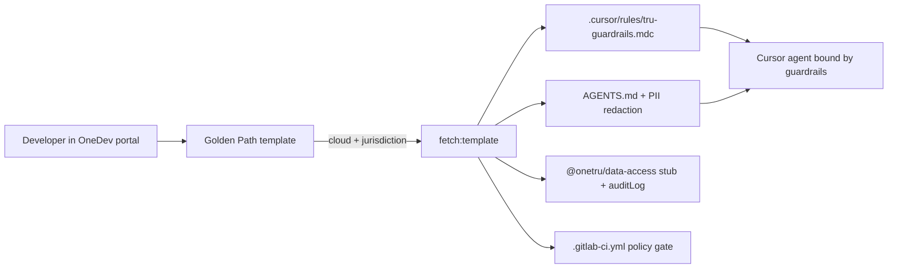

# TransUnion OneDev Demo: Tru Guardrails Golden Path

**Plan ID:** `transunion-onedev`
**Status:** Implemented on branch `cursor/transunion-onedev-5fa7`
**Repo:** Backstage developer portal (this repo)
**Backstage version:** 1.51.0 (`backstage.json`)

## Problem

The demo portal is generically branded ("Acme") and its golden-path template ships
stack/logging conventions but no data-governance or compliance posture. For a targeted
C-suite conversation with TransUnion, the portal should feel like **OneDev** — their
infrastructure abstraction layer that gives developers a standardized, governed path to
production across clouds — and every scaffolded service should start with **OneTru** and
**FCRA** guardrails baked in as Cursor rules, so the AI coding agents developers use are bound
by the same policy.

## Scope

In scope:

- Light rebrand to OneDev / TransUnion (`app-config.yaml`, legacy template title)
- `cloud` (AWS / GCP / Private Cloud) and `jurisdiction` (US / EMEA / APAC) self-service
  parameters on the golden-path template
- "Tru Guardrails" rule pack in the scaffolded skeleton (`.cursor/rules/tru-guardrails.mdc`,
  `AGENTS.md`) covering five principles
- Stub `@onetru/data-access` permissioned client + FCRA `auditLog` in the skeleton, with a test
- Policy-as-code gate in the skeleton `.gitlab-ci.yml`
- Light catalog touch-ups: a OneTru Permissioned Data API entity and jurisdiction annotations

Out of scope:

- Full systems/teams rename and replacing the `nopcommerce-platform` hero entity
- Real per-cloud IaC (Terraform / Harness)
- A real OneTru API, real secret scanner, or runtime permission enforcement (all demo stubs)

## The five Tru Guardrails

1. Permissioned data access only — consumer records flow through `@onetru/data-access`; no
   direct SQL / DB drivers against consumer or credit schemas (OneTru core principle).
2. No PII in logs or exception traces — tokenized `consumerRef` only; scrub error objects.
3. Jurisdictional data separation — US / EMEA / APAC consumer data never crosses (FCRA +
   international equivalents); the chosen jurisdiction is injected into the rule.
4. FCRA-compliant audit trail — every consumer-record function calls
   `auditLog({ permissiblePurpose, consumerRef })`.
5. Secure by design — no credentials in code (OneDev injects secrets); encryption at rest
   enforced at the service layer.

## Acceptance criteria

- [ ] "New OneDev Service (Golden Path)" prompts for cloud and jurisdiction and publishes to GitLab
- [ ] Scaffolded repo contains `.cursor/rules/tru-guardrails.mdc` with all five principles and the
      jurisdiction-specific clause rendered from the chosen parameter
- [ ] Scaffolded `AGENTS.md` shows cloud + jurisdiction context and PII-redaction logging
- [ ] Scaffolded `src/` uses `@onetru/data-access` with `auditLog`; `tsc --noEmit` and `vitest run` pass
- [ ] Catalog loads with `onetru-data-access-api` and jurisdiction annotations
- [ ] Portal title reads "OneDev — TransUnion Developer Portal"

## Architecture

## Demo arc

1. OneDev portal home; a developer needs a new consumer-credit service.
2. Golden-path template, pick GCP + EMEA, scaffold; the repo already carries the guardrails,
   jurisdiction-pinned.
3. Open in Cursor: "add an endpoint returning a consumer's credit file" -> agent uses the OneTru
   API, adds FCRA audit and redacted logging automatically; then "enrich with APAC bureau data"
   -> refusal, citing jurisdictional separation.
4. Open an MR; Bugbot confirms compliance or catches a planted violation.
5. From Cursor via MCP: "Who owns the OneTru data access API and what is its data residency?"
   -> the catalog answers.

## References

- OneTru: https://www.transunion.com/about-us/onetru (permission-based access, data "separately
  housed according to regulatory mandates")
- OneDev: infrastructure abstraction layer, "standardized, governed path to production across
  AWS, GCP, and private clouds," security-by-design
